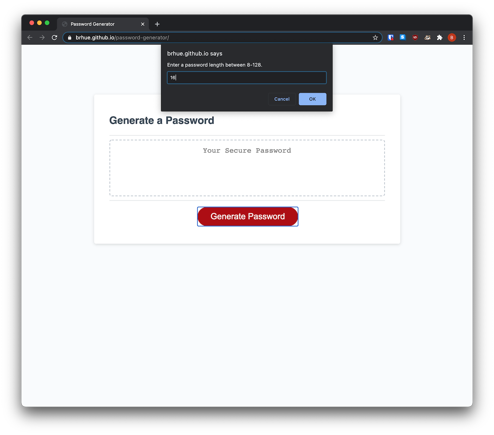
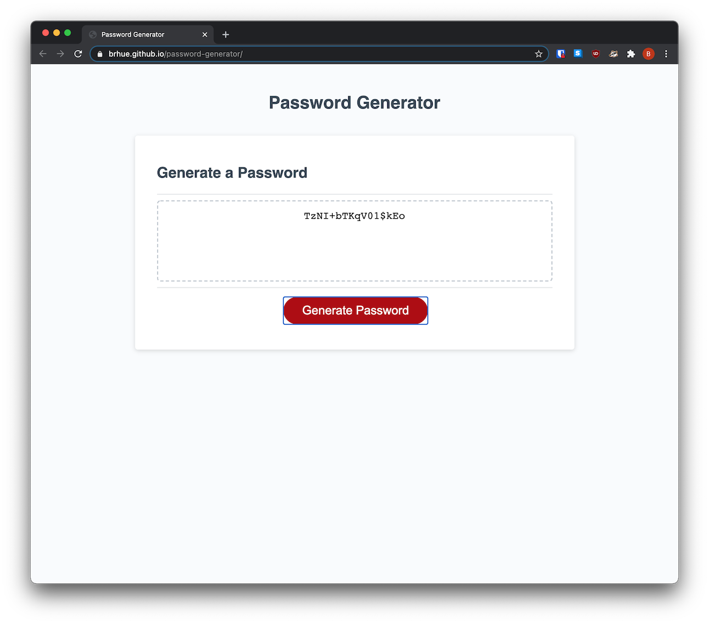

# password-generator

## Description
A simple password generator that features:  
- variable length (8-128 characters)
- special character support
- choice of character types to include (lowercase/uppercase/numeric/special)
## Installation
Clone the repository to your local machine.
## Usage
Open `index.html` in your favorite browser. Then click generate password
and follow the prompts.
## Credits

## License
MIT